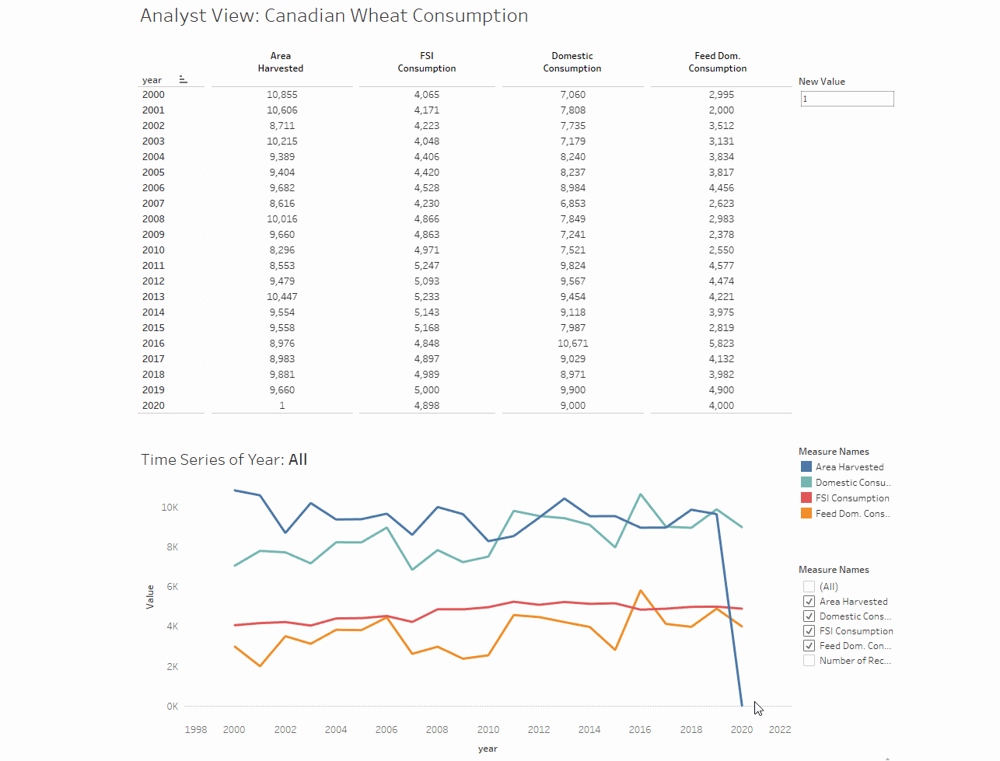

# dynamic-viz
The objective of this project is to develop a dynamic dashboard in Tableau which can update the data source. The dataset for this visualization includes wheat consumption (domestic, fsi, feed dom., etc) in Canada over 20 years timeline.

• XAMPP is used to host the data in a local server.  
• The data is fetched from the local server into Tableau.  
• The Tableau dashboard presents a crosstab and a line chart of the time series data.  
• A REST API is developed using Django which can perform PUT, POST, GET and DELETE request.  
• Any data on the dashbord can be updated dynamically (underneath it uses the REST API).  

# How to run:
1. Download XAMP from the following link:  
https://www.apachefriends.org/download.html

2. Create a database into the server and insert data from the data.csv file. 

3. Download the MYSQL driver from the following link. 
https://www.tableau.com/support/drivers?_ga=2.248449924.208892635.1591984007-131215343.1584834650&_fsi=9MP9fyGg

4. Connect the database (i.e., hosted in the MYSQL server) with Tableu.  

5. Go inside webAPI directory and run the following command.  
> pip install requirement.txt

6. Go inside webAPI/webAPI/settings.py and check the database settings (provide MYSQL server info). 

7. Run the following commands:  
> python manage.py makemigrations
> python manage.py migrate
> python manage.py runserver

8. Go to the localhost using any web browser and copy->paste the following links. 
Get all data/post data: http://127.0.0.1:8000/apiDetails/  
Get specific year data: http://127.0.0.1:8000/apiDetails/<year>    
